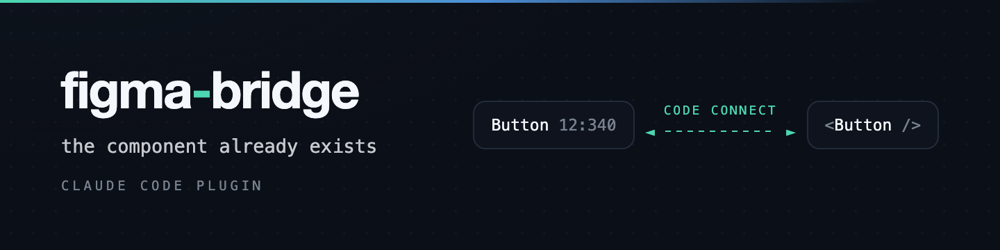

<p align="center">
  
</p>

<p align="center">
  <strong>the component already exists — find it</strong>
</p>

<p align="center">
  A Claude Code plugin for the two-way Figma ↔ code workflow.<br>
  Code Connect mappings are the substrate both directions read, and the correspondence is a<br>
  build invariant rather than a hint — no component in code without a design behind it, no<br>
  published component quietly reimplemented, no value written down instead of bound.
</p>

<p align="center">
  
  
  
  
  
</p>

<p align="center">
  <a href="#see-it">See it</a> ·
  <a href="#what-you-need-first">Requirements</a> ·
  <a href="#install">Install</a> ·
  <a href="#what-it-actually-does">What it does</a> ·
  <a href="#skills">Skills</a> ·
  <a href="#the-checks">Checks</a> ·
  <a href="#developing">Developing</a> ·
  <a href="#license">License</a>
</p>

---

## See it

Same request, same design, same repo. The difference is whether the mapping exists and something
enforces it.

<table>
<tr>
<th width="50%">🙈 Without the bridge</th>
<th width="50%">🔗 With figma-bridge</th>
</tr>
<tr>
<td valign="top">

> **"Build the pricing screen from this Figma frame, using the plan card."**
>
> Searches for `PlanCard`. Finds nothing under that name.
> Writes one — 90 lines, reasonable, in the house style.
>
> Nobody designed it. No Figma node governs its tokens. The
> next agent building a screen cannot find it from a design.
> Discovered in review, three days later.

</td>
<td valign="top">

> **"Build the pricing screen from this Figma frame, using the plan card."**
>
> Resolves the frame's Code Connect links first: every mapped
> instance comes back with the component it renders.
> The card the designer used is already linked — under a
> different name.
>
> Produces a mapping table for every slot, and stops on the
> one slot that has no match instead of inventing it.

</td>
</tr>
</table>

And if it invents one anyway, the write itself fails:

```
Components with no Figma counterpart and no declaration:

  PlanCard  (src/design-system/PlanCard.tsx)

Each one needs a Figma component plus a mapping beside it, or an entry in
design/figma/unmapped-components.json explaining why it has no counterpart. Do not add the
declaration to silence this check — an unmapped component is a design decision, so ask first.
```

That is a `PostToolUse` hook, not a suggestion in a prompt. An instruction is a request; a hook is
enforcement.

The same pair of checks runs the other way — a component the library publishes that the codebase
never picked up is reported too, and a colour written down instead of bound to a token fails. The
correspondence is checked in both directions, which is what makes it a correspondence rather than a
convention.

## What you need first

Code Connect is the substrate this whole thing rests on, and Figma gates it by plan. Check this
before anything else — the CLI fails in a way that reads like a bad token when the plan is the
problem.

| You need | Requirement |
| --- | --- |
| **Code Connect** — publishing mappings, and the snippets Dev Mode shows | a **Dev or Full seat on an Organization or Enterprise plan** ([docs](https://developers.figma.com/docs/code-connect/)) |
| **Figma MCP, remote** — reading designs, and writing them from an agent | available on all seats and plans; agent-driven design creation runs through the remote server, free during its beta and later usage-based ([docs](https://help.figma.com/hc/en-us/articles/32132100833559-Guide-to-the-Figma-MCP-server)) |
| **Figma MCP, desktop** | a Dev or Full seat on any paid plan |
| **A personal access token** for the Code Connect CLI | two scopes, `file_content:read` and `file_code_connect:write`, in `.env.local` |
| **Node** | 22 or newer, for the vendored checks |

Two consequences worth knowing before you plan around them:

- **The Variables REST API is Enterprise-only** — *"available to full members of Enterprise orgs"*
  ([docs](https://developers.figma.com/docs/rest-api/variables-endpoints/)). This plugin therefore
  reads and writes variables through the **Plugin API** via the MCP server, which carries no such
  restriction. Nothing here needs the REST variables endpoints.
- **MCP access is per-user OAuth, and there is no service credential.** So every step that writes to
  Figma runs in an interactive session and never in CI. The checks are the opposite: local,
  hermetic, no API calls, no plan.

<details>
<summary><strong>Below Organization plan</strong> — what still works, and what doesn't</summary>

Without a Code Connect seat you cannot **publish** mappings, so Dev Mode shows no snippet and the
agent cannot resolve a frame's components with `get_code_connect_map`. That is the part of the
workflow the plan buys.

What still works, because it never touches the API: the mapping files themselves, all five audits,
the write guard, the hooks, the doctor, and CI. A repo can keep a correct, enforced
design↔code correspondence on any plan — it just doesn't get the Dev Mode half of it.

</details>

## Install

```
/plugin marketplace add umain-osl/claude-figma-bridge-plugin
/plugin install figma-bridge@figma-bridge
```

Then, in the repo you want it to work in:

```
/figma-bridge:onboard <figma file url>
```

Onboarding is where the repo-specific facts get written down once. It detects the design system,
writes `figma-bridge.json`, snapshots the Figma library, writes the repo's own token map and
library notes, and vendors the checks into `scripts/figma-bridge/` so CI can run them without the
plugin installed.

<details>
<summary><strong>What onboarding leaves behind</strong> — six artifacts, all in your repo</summary>

| Artifact | Holds |
| --- | --- |
| `figma-bridge.json` | design system roots, the Figma file key, which page is retired, the verify commands |
| `design/figma/unmapped-components.json` | components deliberately without a counterpart, each with a written reason |
| `design/figma/components.json` | a committed snapshot of the published Figma components |
| `design/figma/tokens.md` | how this repo's tokens and typography correspond to Figma's variables |
| `design/figma/library-notes.md` | the things about this library a name does not tell you |
| `scripts/figma-bridge/` | the checks, vendored — zero dependencies, so CI needs nothing |

Paths are configurable; those are the defaults.

</details>

## What it actually does

**Figma → code.** Resolve the Code Connect links *before* reading the design, so the components
come from the mappings rather than from a reconstruction of the markup. Honour the designer's
annotations. Carry no hex value and no raw pixel value across — the repo's token map is the only
route from a Figma variable to code.

**Code → Figma.** Push a screen back as real instances of the library with every value bound to a
variable, not a drawing that resembles the screen. Then compare against the designer's frame and
report the differences — sometimes the generated frame is the correct one, because the old frame
uses a component that has since been retired.

**Both directions rest on the mappings**, which is why the plugin spends as much effort on
authoring them as on using them: the parser-form-first recipe, the three defects
`figma connect migrate` reliably introduces, and an audit for the class of fault that publishes
cleanly and only breaks when someone pastes the snippet.

### Generic plugin, specific repo

Every fact about a particular library lives in your repo, not in here. No component name, node id,
font family or utility class appears anywhere in this plugin as a fact.

| In the plugin | In your repo |
| --- | --- |
| the reuse gate and the mapping table it demands | `figma-bridge.json` |
| the Code Connect recipe and `migrate`'s defects | `tokens.md` — this library's variables → your tokens |
| the Plugin API traps and the missing-font technique | `library-notes.md` — names that mislead |
| the checks, the guards, the doctor | the committed component snapshot |

## Skills

| Skill | Use |
| --- | --- |
| `figma-bridge-onboard` | bootstrap a repo — config, vendored checks, library snapshot, token map |
| `figma-bridge-setup` | per-machine setup: the two credentials, the guardrails, the fonts, the cache |
| `design-system-reuse` | the gate before any screen work: intent, inventory, mapping table |
| `figma-to-code` | implement a screen from a Figma node using the linked components |
| `code-to-figma` | push a code screen into Figma as real library instances |
| `figma-code-connect` | author, migrate, audit and publish mappings |

## Commands

| Command | Does |
| --- | --- |
| `/figma-bridge:onboard` | run the onboarding flow |
| `/figma-bridge:doctor` | is this repo and machine wired up? |
| `/figma-bridge:check` | target consistency, component coverage, snippet imports |
| `/figma-bridge:retarget` | point the repo at another Figma file, or verify it points at one |
| `/figma-bridge:refresh-cache` | re-snapshot the library and read the diff as a changelog |

## The hooks

All three no-op in a repo without a `figma-bridge.json`, so the plugin is safe to install globally.

| Hook | Fires | Does |
| --- | --- | --- |
| target guard | `PreToolUse` on the Figma write tools | denies a write to any file but the configured target; fails closed |
| coverage guard | `PostToolUse` on `Write`/`Edit` under the design system roots | reports an invented component, or a colour written down instead of bound, at the moment of the write |
| snippet guard | `PostToolUse` on `Write`/`Edit` of a mapping | reports a snippet that renders an identifier it does not import |

## The checks

`scripts/figma-bridge/` is a zero-dependency Node CLI (Node 22+). Plugin installs run no package
manager, and a script inside a plugin directory cannot resolve the host repo's `node_modules` — so
the checks depend on nothing but Node itself, and keep working in a repo whose CI installs with
`--omit=dev`.

```
figma-bridge check                  retarget --check, then every audit
figma-bridge retarget --check       verify every reference names the target file
figma-bridge retarget <key> [name]  point the whole repo at another file
figma-bridge audit-coverage         no component in code without a design behind it
figma-bridge audit-design-orphans   no published component without code, or baselined
figma-bridge audit-hardcoded-values no colour written down instead of bound to a token
figma-bridge audit-snippets         every snippet imports what it renders
figma-bridge doctor                 is this repo wired up?
figma-bridge guard --pre-write | --post-write
```

<details>
<summary><strong>What each audit catches</strong></summary>

**`audit-coverage`** — a component under the design system roots with neither a mapping nor a
declared reason (the anti-invention guard), a declaration left behind after its file was deleted,
and any mapping pointing at a component on a retired page. That last one matters more than it
sounds: a retired page holds what used to be everywhere, so it accumulates the highest instance
counts in a mature library — rank candidates by popularity and you get dead components first.

**`audit-design-orphans`** — the same question asked backwards: published components no mapping
points at. Coverage alone is half a guarantee, because it says nothing about a component the library
publishes that the codebase has quietly reimplemented or never noticed. Excluded from the count:
retired pages, Figma's private (`.`-prefixed) components, and any page named by
`figma.ignorePagePattern` — an icon set the codebase holds as SVGs, a cover page, documentation.
Name those, or two thirds of the list is noise and nobody reads it. It **reports** by default and passes, because a
library holds more than any one codebase uses and a check that fails on that gets switched off. Set
`figma.designOnly` to `"baseline"` and it becomes a ratchet: whatever is unmapped today is accepted
once, in writing, and anything new must be mapped or accepted deliberately.

**`audit-hardcoded-values`** — a colour written down instead of bound to a token. Until this existed
the token map was a document rather than a gate, which made the weakest link in the correspondence
the easiest one to cross: a hardcoded colour is a value no Figma variable governs, so changing the
token leaves it behind. Colours only, deliberately — a raw number in a layout is ambiguous, and a
check that cries wolf takes the useful half down with it. The file that defines the palette goes in
`tokens.allowLiteralsIn`; the doctor fails if one of those patterns stops matching anything, since a
stale exception is a hole nobody is looking at. Comments are not values — a colour quoted from a
design inside a `{/* … */}` block is documentation, and block state is tracked across lines so the
continuation lines are not flagged either.

**`audit-snippets`** — every identifier a published snippet renders must be imported, and no import
may be relative, because a snippet is pasted somewhere else. This is the fault `figma connect
migrate` introduces systematically and nothing else catches: the template is valid JavaScript, and
`publish` accepts it.

**`retarget --check`** — the file key appears in the config, in every mapping's `// url=` directive,
in every component doc-link and in the component cache. All four must agree, because a partial
rewrite publishes a mixture, or sends a developer to the wrong library.

</details>

## Developing

```bash
./tests/run.sh              # 38 cases against a throwaway fixture repo
claude plugin validate .    # both manifests
```

Every case asserts both directions: the clean fixture passes, and an invented component, an unmapped
published component, a hardcoded colour, a broken ratchet, a stale baseline entry, a stale
declaration, a mapping onto a retired page, a snippet missing an import, a relative import, a
doc-link naming another file, a cache from another file and a malformed config each fail with the
message that explains them. Both guards are tested for firing *and* for staying silent in a repo
with no config.

The banner is generated, not hand-drawn — edit `docs/assets/banner.html` and re-render:

```bash
"/Applications/Google Chrome.app/Contents/MacOS/Google Chrome" --headless --disable-gpu \
  --force-device-scale-factor=2 --window-size=720,180 \
  --screenshot="$PWD/docs/assets/banner.png" "file://$PWD/docs/assets/banner.html"
```

Commit subjects follow [Conventional Commits](https://www.conventionalcommits.org/), and CI fails a
PR whose commits or title do not — the log is the only changelog this repo has. Turn on the local
hook so you find out at commit time rather than after a push:

```bash
git config core.hooksPath .githooks
```

`main` takes no direct pushes. Every change goes through a pull request with an approving review
from the code owner in `.github/CODEOWNERS` and all five checks green:

| Check | Green means |
| --- | --- |
| `tests on Node 22` | every script parses, and the fixture suite's 38 cases pass on the oldest Node still in support |
| `tests on Node 24` | the same on current Node |
| `manifests agree` | `plugin.json` and the marketplace entry describe the same plugin at a valid version |
| `plugin version bump` | either nothing users receive changed, or the version moved |
| `conventional commits` | every commit subject and the PR title parse as Conventional Commits |

Repository admins can bypass all of it, which is not an oversight: with a single code owner,
GitHub's refusal to count an author as their own approver would otherwise make the owner's pull
requests unmergeable.

**Bump `version` in `.claude-plugin/plugin.json` in any PR that changes a shipped file.** Claude
Code decides whether to re-download by comparing that string, so a change merged under an unchanged
version never reaches anyone — and reports the stale copy as already up to date. CI enforces it.
Versions only go up, and a version string is never reused.

## License

All rights reserved. Public so it can be installed, not so it can be reused — no licence is
granted to copy, modify or redistribute it.

---

<p align="center">
  <sub>Not affiliated with or endorsed by Figma. "Figma" and "Code Connect" are Figma's marks,<br>
  used here only to say what this plugin talks to.</sub>
</p>
